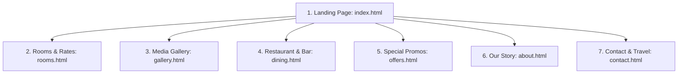
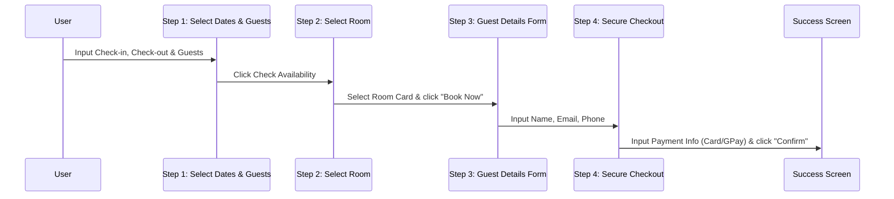

# Dambulla Tiger Rock - Page & Flow Structure Specification

This document defines the page architecture, component breakdown, step-by-step booking flow, and mobile responsive adaptations, based on the luxury resort case study structure.

---

## 📂 Page Architecture

The web platform is structured into **seven core pages** to deliver a premium, content-rich storytelling experience.

### 1. Home Page (`index.html`)
- **Hero Canvas:** Immersive full-screen background image of Dambulla summit forest views, header navigation, and overlay title: *"Experience Nature in Luxury"*.
- **Booking Bar:** Glassmorphism overlay positioned at the bottom of the hero block.
- **Resort Pillars:** A three-section row highlighting the resort's cores: `Wellness`, `Adventure`, and `Sustainability`.
- **Introduction Segment ("01 Introduction"):** Left-side photo grid (outdoor dining/nature) and right-side text column describing the 360° climbing and forest retreat.
- **Accommodations Showcase:** A 3-column category grid showing links to `Rooms`, `Suites`, and `Villas` with horizontal CTA.
- **Stay in Package Slider:** A horizontal card carousel presenting specific packages (e.g. *Sunset Chalet*, *Pidurangala Sunrise Package*) with individual `Book Now` CTAs.
- **Interactive Service List:** Vertical photo on the left, accordion expansion list on the right (Accommodations, Dining, Wellness, Adventures, Events).
- **Testimonial Slider:** Customer quote block over a dark green card backdrop.
- **Social Inspiration Grid ("Feel Inspired"):** Masonry grid linking Instagram pictures.
- **Footer Block:** Multi-column links (Rooms, Accommodations, Sustainability, Address, Booking & Support) with bottom Booking bar insertion.

### 2. Rooms & Rates Page (`rooms.html`)
- **Hero Title Banner:** Slim header card displaying "Rooms & Rates" with sub-booking bar.
- **Sidebar Filters (Left):**
  - Interactive mini-map selector ("Show on map").
  - Room type checkboxes (Forest Cabins, Cliff Villas, Earth Domes, Bamboos, Lakefront).
  - Rate/Price slider ($100 - $1200+).
  - Floor area select.
  - Amenity tag selectors (Pool, Gym, Aircon, Free Wifi, Electricity backup).
- **Listing Grid (Right):**
  - 3-column card grid of available chalets (Garden Haven, Sunset Suite, etc.).
  - Pagination row at bottom (`< 1 2 3 4 5 >`).

### 3. Gallery Page (`gallery.html`)
- **Breadcrumb Navigation:** `Home > Gallery`.
- **Filter Tabs Bar:** Row of tags (`All`, `Hotel`, `Views`, `Restaurant`) to filter grid contents dynamically.
- **Visual Masonry Grid:** Responsive image display with differing aspect ratios, rounded corners, and lightbox zoom on click.

### 4. Restaurant & Dining Page (`dining.html`)
- **Hero Title Banner:** "Savor Every Bite in Paradise" backdrop.
- **Story Block:** Description details of the fine dining setup, local Sri Lankan ingredients, and table reservation button.
- **Specialty Grid:** Highlights signature local dishes and cocktails with individual table book prompts.
- **Opening Hours Card:** Centered scheduling card (Open Tuesday - Saturday, 7:00 PM - 9:30 PM).

### 5. Offers Page (`offers.html`)
- **Header:** "Special Offers" banner.
- **Promotional Grid:** List of promotional cards (e.g., "25% off for February Bookings", "3-Night Getaway Package") with quick check-out links.

---

## 🔄 Interactive Booking Flow Modal

The booking engine is built as an interactive multi-step wizard overlaying the active screen.

### Wizard Step Specifications

1. **Step 1 (Select Dates & Guests):**
   - Calendar date picker interface for Check In & Check Out.
   - Guest count selector dropdown.
2. **Step 2 (Choose Your Room):**
   - Grid list showing matching rooms with ratings, photos, and prices.
   - Filter drawer/sidebar sliding out to adjust size, price, and types.
3. **Step 3 (Guest Information):**
   - Text fields: `First Name*`, `Last Name*`, `Email*`, `Phone*`.
   - Right-side sidebar displaying the Booking Summary (dates, nights count, pax, total cost breakdown).
4. **Step 4 (Payment):**
   - Dual checkout options: GPay click-button or standard credit card input fields (Holder name, Card number, Expiry, CVV).
   - Coupon voucher code entry bar.
5. **Success Screen:**
   - Confirmation text, checkmark animation, unique Booking ID generation, guest outline, and buttons to download receipt or close modal.

---

## 📱 Mobile-First Responsive Mapping

To ensure a premium booking experience on mobile devices (tablets and smartphones):

| Desktop Component | Mobile Adaptation Behavior |
| :--- | :--- |
| **Navigation Menu** | Collapses to a sticky top header hamburger icon (`☰ Menu`) that slides open full-screen. |
| **Booking Bar** | Hero bar collapses to a single floating button ("Book Now") at the bottom of the viewport. |
| **Filter Sidebar** | Collapses into a floating sticky drawer button ("Filters ☖") that opens full-width from the side. |
| **Grids (Rooms, Dining, Gallery)** | Grid columns collapse: 3-column desktop rows wrap to a scrollable 1-column layout. |
| **Stay in Package Carousel** | Swaps desktop slider navigation to native mobile touch-swipe gesture support with pagination dots. |
| **Form Fields (Guest & Payment)** | Input margins are enlarged for fat-finger tapping, with native calendar popups for date fields. |
