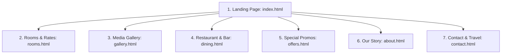
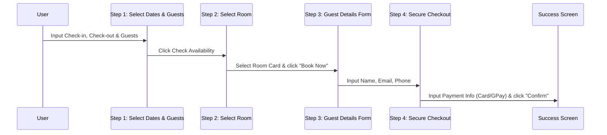

# Dambulla Tiger Rock - Page & Flow Structure Specification

This document captures the site map, current live pages, booking flow, and responsive behavior for Dambulla Tiger Rock.

---

## Current Live Pages

The repository currently ships these live pages:

- `index.html` - landing page and home story
- `cabanas.html` - A-frame cabana showcase
- `experiences.html` - experiences and amenities
- `booking.html` - standalone booking request page
- `admin.html` - admin utility page

`booking.html` and `cabanas.html` now read live room data from `GET /api/rooms`, so admin changes to room name, room type, condition, amenities, facilities, price, quantity, and image update both pages automatically.

---

## Current Room Memory

Current room records in the database:

| Room ID | Name | Type | Condition | Price | Qty |
| :--- | :--- | :--- | :--- | :--- | :--- |
| `Cabana-1` | Deluxe Room with Mountain View | `""` | `""` | `40` | `2` |
| `sunrise-loft` | The Sunrise Loft | Signature Loft | Excellent | `180` | `2` |
| `sigiriya-view` | The Sigiriya View Chalet | View Chalet | Excellent | `220` | `1` |

`Cabana-1` is the legacy record that currently has amenities and facilities attached:

- Amenities: Two Floors, Mini Fridge, Sofa Bed, Private Bathroom
- Facilities: Hot Water Shower, Air Condition

The other two rooms are seeded defaults and can be edited from `admin.html`.

`booking.html` is modeled on the Green Breeze booking page structure, but all colors, wording, and property details are Tiger Rock specific.

---

## Page Architecture

The long-term web platform is structured into seven core content pages to deliver a premium, content-rich storytelling experience.

```mermaid
graph TD
    Home[1. Landing Page: index.html] --> Rooms[2. Rooms & Rates: rooms.html]
    Home --> Gallery[3. Media Gallery: gallery.html]
    Home --> Dining[4. Restaurant & Bar: dining.html]
    Home --> Offers[5. Special Promos: offers.html]
    Home --> About[6. Our Story: about.html]
    Home --> Contact[7. Contact & Travel: contact.html]
```

### 1. Home Page (`index.html`)
- Hero canvas with full-screen background imagery, header navigation, and a premium brand title.
- Glassmorphism booking bar positioned at the bottom of the hero block.
- Resort pillar row highlighting wellness, adventure, and sustainability.
- Introduction section with image grid and story copy.
- Cabana showcase with room cards and CTA links.
- Service accordion, testimonial slider, social inspiration grid, and footer links.

### 2. Cabanas Page (`cabanas.html`)
- Hero banner with strong visual intro.
- Two featured cabana cards for the A-frame units.
- Stats bar and CTA band for reservations.

### 3. Experiences Page (`experiences.html`)
- Experience cards for summit trail, dining, ATV ride, bike hire, and Sigiriya trips.
- Town proximity highlight section.
- Concierge CTA and support links.

### 4. Booking Page (`booking.html`)
- Hero section with concierge-style introduction.
- Package selector cards for the two cabanas plus a custom-quote option.
- Guest form with dates, name, email, phone, add-ons, and special requests.
- Sticky summary panel with estimated total.
- WhatsApp handoff for booking requests.

### 5. Rooms & Rates Page (`rooms.html`)
- Planned hero banner and filter sidebar.
- Listing grid for room and chalet options.

### 6. Gallery Page (`gallery.html`)
- Planned breadcrumb and filter tabs.
- Masonry grid with lightbox interaction.

### 7. Restaurant & Dining Page (`dining.html`)
- Planned hero banner, story block, specialty grid, and opening-hours card.

### 8. Offers Page (`offers.html`)
- Planned promotional cards and quick checkout links.

---

## Interactive Booking Flow Modal

The original booking engine is built as an interactive multi-step wizard overlaying the active screen.

```mermaid
sequenceDiagram
    participant User
    participant Step1 as Step 1: Select Dates & Guests
    participant Step2 as Step 2: Select Room
    participant Step3 as Step 3: Guest Details Form
    participant Step4 as Step 4: Secure Checkout
    participant Confirm as Success Screen

    User->>Step1: Input Check-in, Check-out & Guests
    Step1->>Step2: Click Check Availability
    Step2->>Step3: Select Room Card & click "Book Now"
    Step3->>Step4: Input Name, Email, Phone
    Step4->>Confirm: Input Payment Info (Card/GPay) & click "Confirm"
```

### Wizard Step Specifications

1. Step 1, Select Dates and Guests
- Calendar date picker interface for check-in and check-out.
- Guest count selector dropdown.

2. Step 2, Choose Your Room
- Grid list showing matching rooms with ratings, photos, and prices.
- Filter drawer/sidebar for size, price, and room types.

3. Step 3, Guest Information
- Text fields for first name, last name, email, and phone.
- Right-side sidebar displaying booking summary, nights, pax, and total breakdown.

4. Step 4, Payment
- GPay express option plus standard credit card inputs.
- Coupon voucher code entry bar.

5. Success Screen
- Confirmation text, checkmark animation, unique Booking ID generation, guest outline, and buttons to download receipt or close modal.

### Standalone Booking Page Notes

- The standalone `booking.html` page uses the same brand language, but it is not the modal wizard.
- It is designed as a simpler request flow for guests who want to send a concierge-style inquiry without stepping through the full modal checkout.
- Total calculation is intentionally lightweight: nightly rate plus optional add-ons, with a custom-quote fallback when the selected package is not fixed-price.

---

## Mobile-First Responsive Mapping

To ensure a premium booking experience on mobile devices, the site adapts as follows:

| Desktop Component | Mobile Adaptation Behavior |
| :--- | :--- |
| Navigation menu | Collapses to a sticky top header hamburger menu that slides open full-screen. |
| Booking bar | Collapses to a single floating button at the bottom of the viewport. |
| Standalone booking page | Two-column layout collapses to one column; package cards stack above the summary panel, and the submit CTA fills the width. |
| Filter sidebar | Collapses into a floating drawer button that opens full-width from the side. |
| Grids (Rooms, Dining, Gallery) | Grid columns collapse from multi-column layouts to a single-column stack. |
| Stay in package carousel | Swaps desktop slider navigation to native mobile swipe behavior. |
| Form fields | Input spacing is enlarged for easier tapping, with native date pickers on supported devices. |
